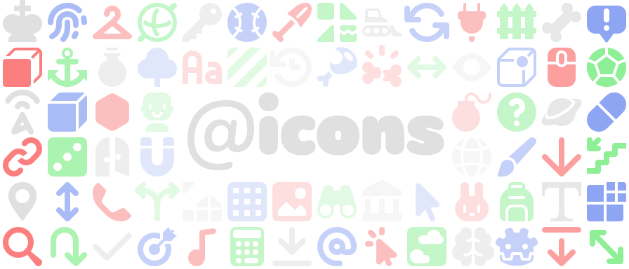
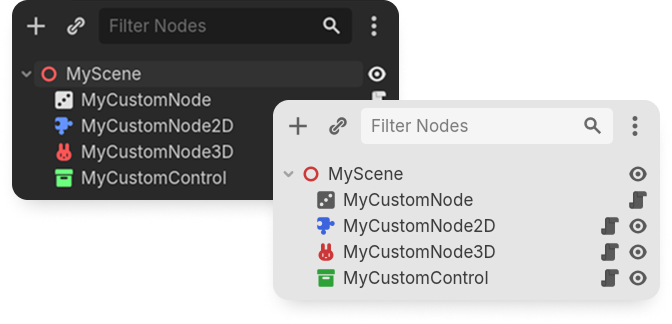

# @icons

<p align="center">
	<picture>
	<source media="(prefers-color-scheme: dark)" srcset="docs/logo_dark_theme.svg">
	<source media="(prefers-color-scheme: light)" srcset="docs/logo_light_theme.svg">
	
	</picture>
</p>

**@icons** is a free and open-source library of 500+ vector (SVG) icons you can use as custom node icons in your Godot projects or plugins, designed to fit with the existing set of editor icons, and optimized using [svgo](https://svgo.dev/).

Each icon is designed on a 16×16 grid, with color variants corresponding to every node type. They're also configured to work with any editor theme and scaling settings out of the box!

<p align=center>
    
</p>

## Installing

> [!CAUTION]
> Do not install **@icons** by cloning or downloading the repository as a ZIP file, as it contains source files for the web picker which cannot be used on their own.

Download the [latest release](https://github.com/voxybuns/at-icons/releases/latest) of **@icons** (also available on [itch.io](https://voxybuns.itch.io/at-icons), [Godot Asset Store](https://store.godotengine.org/asset/voxy/at-icons/), and the [Godot Asset Library](https://godotengine.org/asset-library/asset/5302)), and extract it into the root of your Godot project's folder. If you wish to use the icons in your plugin or addon, you can also copy individual icons along with their respective `.import` files into your plugin's folder, along with the library's license.

## Applying custom node icons

To apply an icon to a node or class, add the [`@icon` annotation (GDScript)](https://docs.godotengine.org/en/stable/classes/class_@gdscript.html#class-gdscript-annotation-icon) or [icon attribute (C#)](https://docs.godotengine.org/en/stable/tutorials/scripting/c_sharp/c_sharp_global_classes.html#c-global-classes) to your node's script, followed by the path to the desired icon in parentheses and quotes **before** the class declaration, like so:

**GDScript:**
```gdscript
@icon ("res://addons/at-icons/node/bunny.svg")
class_name MyNode
extends Node
```

**C#:**
```csharp
using Godot;

[GlobalClass, Icon("res://addons/at-icons/node/bunny.svg")]
public partial class MyNode : Node
{
    ...
}
```

You might need to close and open the scene again for the icon change to occur.

The plugin is bundled with an HTML picker (since v1.1.0) and an in-editor dock (since v1.3.0) to easily preview the icons and copy their respective declaration to the clipboard.

## Contributing

Thank you for wanting to contribute to the project!

For the time being, I won't accept pull requests containing new icons to ensure consistency. However, you can suggest a new icon or report problems with existing icons by opening up a [new issue](https://github.com/voxybuns/at-icons/issues/new/choose). I will try to address them to the best of my abilities!

## Supporting this project

**@icons** is completely free to download and use. However, if you wish to financially support the creation of more icons, you can either donate on [itch.io](https://voxybuns.itch.io/at-icons), or on my [Ko-fi page](https://ko-fi.com/voxybuns). Thank you so very much! ❤️

## Licensing

**@icons** is licensed under the MIT license. See [LICENSE](LICENSE) for more information.
